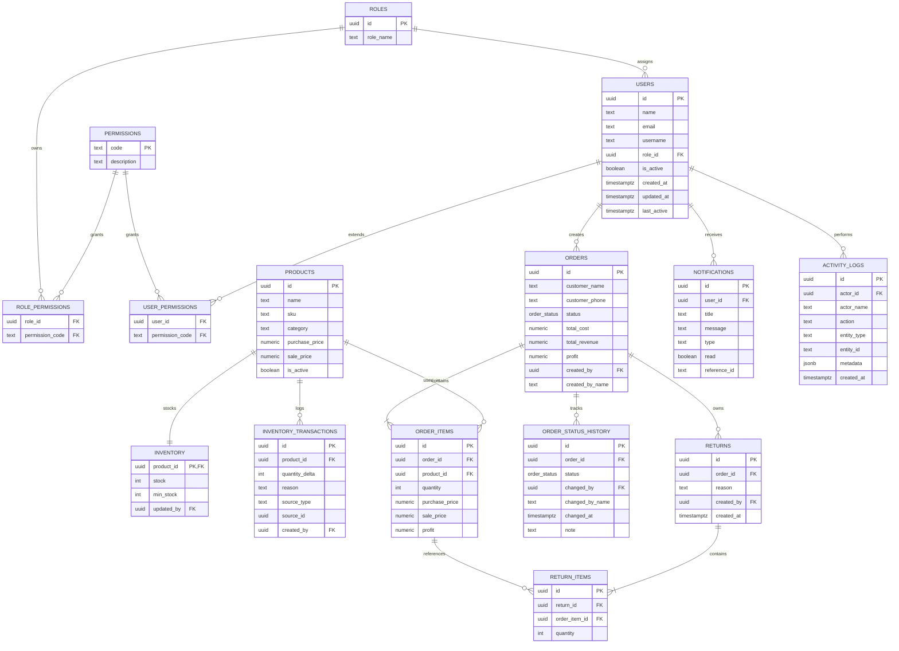

# Top Quality ERD

```mermaid
erDiagram
  ROLES ||--o{ USERS : assigns
  PERMISSIONS ||--o{ ROLE_PERMISSIONS : grants
  ROLES ||--o{ ROLE_PERMISSIONS : owns
  USERS ||--o{ USER_PERMISSIONS : extends
  PERMISSIONS ||--o{ USER_PERMISSIONS : grants
  PRODUCTS ||--|| INVENTORY : stocks
  PRODUCTS ||--o{ INVENTORY_TRANSACTIONS : logs
  PRODUCTS ||--o{ ORDER_ITEMS : used_in
  USERS ||--o{ ORDERS : creates
  ORDERS ||--|{ ORDER_ITEMS : contains
  ORDERS ||--o{ ORDER_STATUS_HISTORY : tracks
  ORDERS ||--o{ RETURNS : owns
  RETURNS ||--|{ RETURN_ITEMS : contains
  ORDER_ITEMS ||--o{ RETURN_ITEMS : references
  USERS ||--o{ NOTIFICATIONS : receives
  USERS ||--o{ ACTIVITY_LOGS : performs

  ROLES {
    uuid id PK
    text role_name
  }

  PERMISSIONS {
    text code PK
    text description
  }

  ROLE_PERMISSIONS {
    uuid role_id FK
    text permission_code FK
  }

  USERS {
    uuid id PK
    text name
    text email
    text username
    uuid role_id FK
    boolean is_active
    timestamptz created_at
    timestamptz updated_at
    timestamptz last_active
  }

  USER_PERMISSIONS {
    uuid user_id FK
    text permission_code FK
  }

  PRODUCTS {
    uuid id PK
    text name
    text sku
    text category
    numeric purchase_price
    numeric sale_price
    boolean is_active
  }

  INVENTORY {
    uuid product_id PK, FK
    int stock
    int min_stock
    uuid updated_by FK
  }

  INVENTORY_TRANSACTIONS {
    uuid id PK
    uuid product_id FK
    int quantity_delta
    text reason
    text source_type
    uuid source_id
    uuid created_by FK
  }

  ORDERS {
    uuid id PK
    text customer_name
    text customer_phone
    order_status status
    numeric total_cost
    numeric total_revenue
    numeric profit
    uuid created_by FK
    text created_by_name
  }

  ORDER_ITEMS {
    uuid id PK
    uuid order_id FK
    uuid product_id FK
    int quantity
    numeric purchase_price
    numeric sale_price
    numeric profit
  }

  ORDER_STATUS_HISTORY {
    uuid id PK
    uuid order_id FK
    order_status status
    uuid changed_by FK
    text changed_by_name
    timestamptz changed_at
    text note
  }

  RETURNS {
    uuid id PK
    uuid order_id FK
    text reason
    uuid created_by FK
    timestamptz created_at
  }

  RETURN_ITEMS {
    uuid id PK
    uuid return_id FK
    uuid order_item_id FK
    int quantity
  }

  NOTIFICATIONS {
    uuid id PK
    uuid user_id FK
    text title
    text message
    text type
    boolean read
    text reference_id
  }

  ACTIVITY_LOGS {
    uuid id PK
    uuid actor_id FK
    text actor_name
    text action
    text entity_type
    text entity_id
    jsonb metadata
    timestamptz created_at
  }
```

